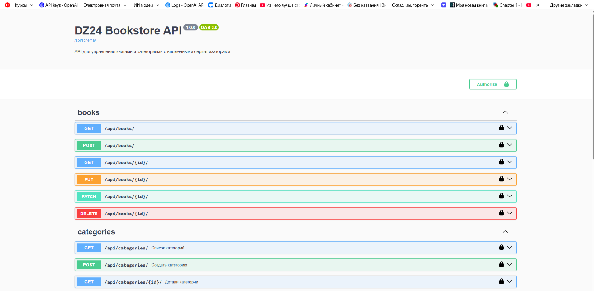
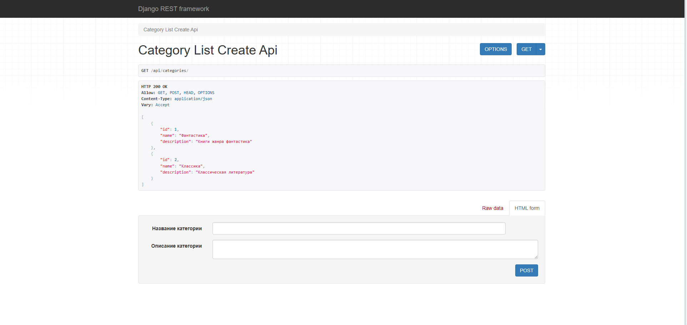
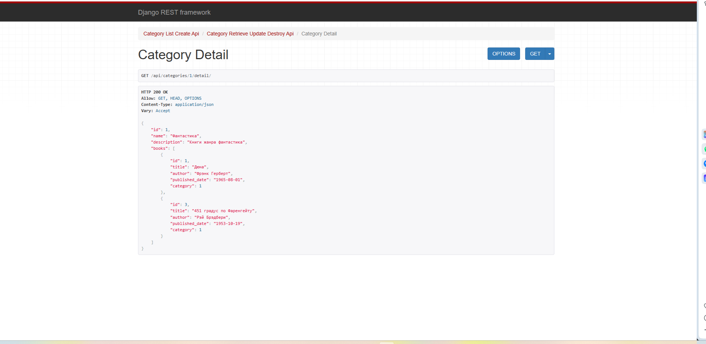
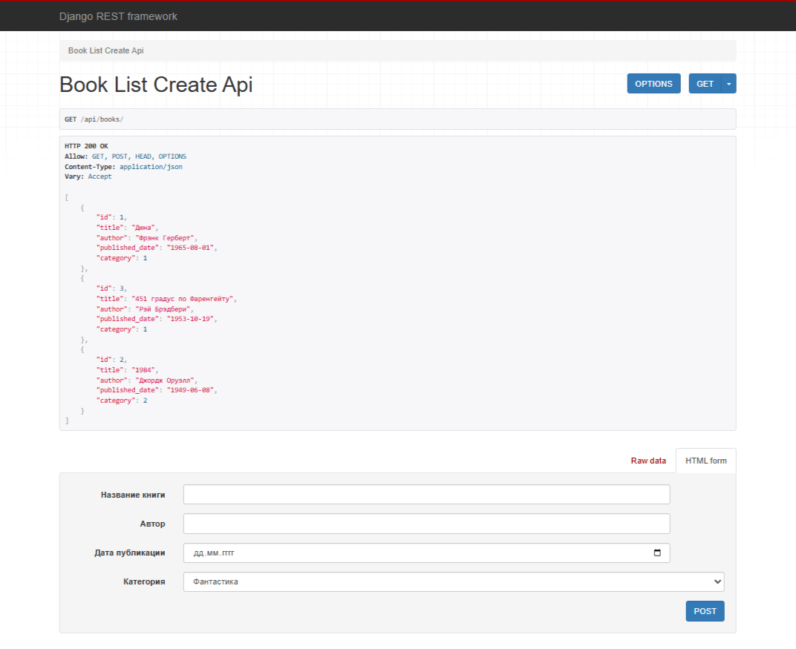

# 📚 DZ24 — Вложенные сериализаторы и Swagger-документация

[](https://www.python.org/)
[](https://www.djangoproject.com/)
[](https://www.django-rest-framework.org/)
[]()

**Автор:** Виктор Куличенко  
**Занятие:** #24 — Введение в веб-сервисы. Django REST Framework  
**Статус:** ✅ Завершено

---

## 📌 О проекте

Django REST Framework API для управления книгами и категориями с **вложенными сериализаторами**, **оптимизацией запросов** и **автоматической Swagger-документацией**.

Проект демонстрирует ключевые возможности DRF:
- Связь между моделями через `ForeignKey`
- Вложенные сериализаторы для отображения связанных данных
- Оптимизацию запросов к БД с помощью `prefetch_related`
- Документирование API через `drf-spectacular` (OpenAPI 3.0 / Swagger)

---

## 🚀 Быстрый старт

### 1. Клонирование и настройка окружения
```bash
git clone https://github.com/VictorKVS/DZ_24_Django_-REST_-Framework.git
cd DZ_24_Django_-REST_-Framework
python -m venv venv
venv\Scripts\activate  # Windows
# source venv/bin/activate  # Linux/macOS
pip install django djangorestframework drf-spectacular
```
2. Миграции и запуск

python manage.py migrate
python manage.py runserver

3. Наполнение БД тестовыми данными

python scripts/populate_data.py

4. Доступные эндпоинты
📚 Swagger-документация: http://127.0.0.1:8000/api/docs/
📂 Список категорий: http://127.0.0.1:8000/api/categories/
📖 Список книг: http://127.0.0.1:8000/api/books/
🎯 Категория с вложенными книгами: http://127.0.0.1:8000/api/categories/1/detail/


## 📌 API Эндпоинты

| URL | Метод | Описание |
|-----|-------|----------|
| `/api/categories/` | GET, POST | Список всех категорий / создание новой |
| `/api/categories/<pk>/` | GET, PUT, PATCH, DELETE | Детали, обновление или удаление категории |
| `/api/categories/<pk>/detail/` | GET | **Категория с вложенным списком книг** |
| `/api/books/` | GET, POST | Список всех книг / создание новой |
| `/api/books/<pk>/` | GET, PUT, PATCH, DELETE | Детали, обновление или удаление книги |
| `/api/docs/` | GET | Интерактивная Swagger-документация |


🎯 Ключевые особенности реализации
1. Связь между моделями
Модель Book связана с Category через ForeignKey:
category = models.ForeignKey(
    Category, 
    on_delete=models.CASCADE, 
    related_name="books", 
    verbose_name="Категория"
)

2. Вложенные сериализаторы
Для отображения категории со списком книг используется CategoryDetailSerializer:

class CategoryDetailSerializer(serializers.ModelSerializer):
    books = BookSerializer(many=True, read_only=True)

    class Meta:
        model = Category
        fields = ['id', 'name', 'description', 'books']

3. Оптимизация запросов
Использование prefetch_related предотвращает проблему N+1 запросов:

queryset = Category.objects.prefetch_related('books')

4. Swagger-документация
Декораторы @extend_schema и @extend_schema_view из drf_spectacular.utils добавляют описания к эндпоинтам:


@extend_schema_view(
    get=extend_schema(
        summary="Детальная категория с книгами",
        description="Получение категории с вложенными данными (книги в категории). "
                    "Использует prefetch_related для оптимизации запросов к БД."
    )
)
class CategoryDetailView(RetrieveAPIView):
    ...

📋 Пример ответа API
Запрос: GET /api/categories/1/detail/
Ответ:

{
    "id": 1,
    "name": "Фантастика",
    "description": "Книги жанра фантастика",
    "books": [
        {
            "id": 1,
            "title": "Дюна",
            "author": "Фрэнк Герберт",
            "published_date": "1965-08-01",
            "category": 1
        },
        {
            "id": 2,
            "title": "1984",
            "author": "Джордж Оруэлл",
            "published_date": "1949-06-08",
            "category": 1
        }
    ]
}


 Стек технологий
Backend: Python 3.10+, Django 5.x
REST API: Django REST Framework
Документация API: drf-spectacular (OpenAPI 3.0 / Swagger)
База данных: SQLite (dev)

📂 Структура проекта

```text

DZ_24_Django_REST_Framework/
├── config/             # Настройки Django (settings, urls)
├── api/                # Основное приложение
│   ├── models.py       # Модели Book и Category
│   ├── serializers.py  # Сериализаторы (включая вложенные)
│   ├── views.py        # Представления с декораторами Swagger
│   ├── urls.py         # Маршруты API
│   └── migrations/     # Файлы миграций
├── scripts/            # Скрипты (наполнение БД)
├── manage.py           # Управляющий скрипт Django
└── README.md           # Этот файл

```
## 📸 Демонстрация работы API

### Swagger-документация (OpenAPI 3.0)

*Интерактивная документация API, сгенерированная через drf-spectacular*

### Основные эндпоинты

#### Список категорий с формой создания

*GET/POST /api/categories/ — список категорий + интерактивная форма создания*

#### Категория с вложенными книгами ⭐

*GET /api/categories/1/detail/ — ключевая функция: категория с вложенным списком книг (CategoryDetailSerializer + prefetch_related)*

#### Список книг с формой создания

*GET/POST /api/books/ — список книг + интерактивная форма создания*

---

---


👤 Автор
Viktor Kulichenko
Software Engineer / Information Security Specialist
GitHub
© 2026 Виктор Куличенко. Проект выполнен в рамках курса "Python-разработчик I".
